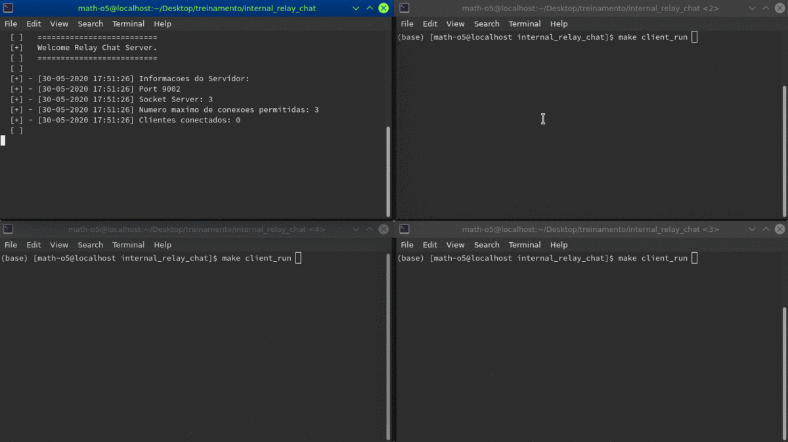

<h1 style="color=red;">Bate-Papo :speech_balloon:</h1>
epic trabalhinho redes: <strong>Internal Relay Chat (IRC)</strong>

<h2>Descrição</h2>

Implementação dos antigos <strong>Internal Relay Chat (IRC)</strong>, o qual pode ser chamado também de antigo Telegram. O protocolo de comunicação seguido foi o IRC 1459, o qual estabelece um padrão de comunicação client-server.

 Essa aplicação permite a comunicação entre multiplos processos e em máquinas distintas. Para isso, basta executar a aplicação do servidor e a aplicação do cliente. Podem ser executados diversos clientes.

## Compilando e Executando
Inicialmente, o servidor é compilado com `make server` e executado com `make server_run`, similarmente o cliente: `make client` `make client_run`; ambos a partir da pasta root do projeto.
Para mais detalhes, <a href="/client_src">client_src</a> e <a href="/server_src">server_src</a> contém melhores explicações de como proceder seguramente.

## Executando em outras máquinas
Para excutar em outras máquinas, execute primeiro o servidor e então o comando `ssh -R relayChatMaster.serveo.net:9002:localhost:9002 serveo.net`. Esse comando vai fazer o <a href="https://www.ssh.com/ssh/tunneling/example">ssh tunneling</a> da porta em que seu servidor executa com ajuda do <a href="http://serveo.net/">server.net</a>. Agora você pode acessar remotamente o servidor. Para se conectar, bastar executar a aplicação do cliente em qualquer máquina e usar `/connect relayChatMaster.serveo.net`. 

## Demo
O primeiro terminal é o servidor, seguido de três clientes.

	</img>

## Lista de comandos
Users: 
`• /connect - Estabelece a conexão com o servidor;` 
`• /quit - O cliente fecha a conexão e fecha a aplicação;` 
`• /ping - O servidor retorna "pong"assim que receber a mensagem;` 
`• /join nomeCanal - Entra no canal;` 
`• /nickname apelidoDesejado - O cliente passa a ser reconhecido pelo apelido especificado;` 
`• /ping - O servidor retorna "pong"assim que receber a mensagem.` 

Admin: 
`• /kick nomeUsurio - Fecha a conexão de um usuário especificado;` 
`• /mute nomeUsurio - Faz com que um usuário não possa enviar mensagens neste canal;` 
`• /unmute nomeUsurio - Retira o mute de um usuário;` 
`• /whois nomeUsurio - Retorna o endereço IP do usuário apenas para o administrador;` 
`• /invite nomeUsuario - convida o usuário para o canal.` 

## Nas pastas...
<ul>
	<li><a href="/client_src">client_src</a> executaveis, esquemas e README documentando-os. O "makeClient" facilita o teste de clientes.</li>
	<li><a href="/server_src">server_src</a> executaveis, fluxograma e README documentando-os.</li>
	<li><a href="/assets">assets</a> Todas imagens e arquivos visuais.</li>
	<li><a href="/socket_example">socket_example</a> Outras versões feitas para testes apenas.</li>
</ul>

A seguir demo e imagens <strong>inéditas</strong> de testes e dados.

<h2>Testando com htop</h2>

Obs: o status R(Running) e S(Sleeping)

Nas imagens é possível ver CPU, MEM e qual thread está correndo. Podemos ver resultados otimistas.

	</img>
	</img>

<h2>Ambientes testados</h2>

OS: Fedora 30.x 
gcc version 9.2.1 20190827 (Red Hat 9.2.1-1)  
g++ (GCC) 9.2.1 20190827 (Red Hat 9.2.1-1) 

OS: Ubuntu 18.04.4 LTS x86_64 
Shell: bash 4.4.20 
g++ (Ubuntu 7.5.0-3ubuntu1~18.04) 7.5.0 

