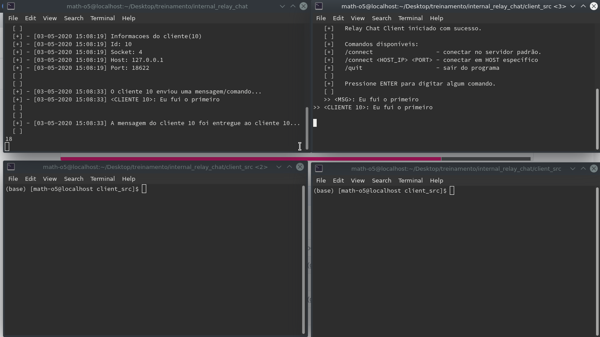
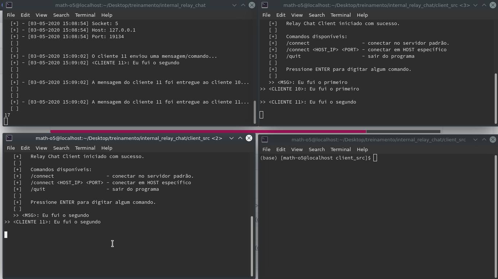
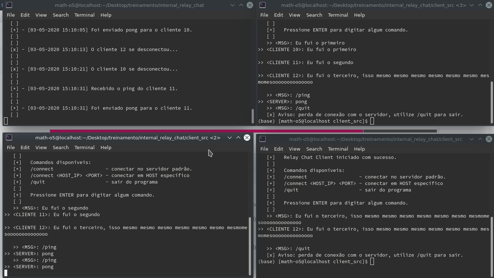

<h1 style="color=red;">internal_relay_chat</h1>
 
epic trabalhinho redes

<h2>Descrição</h2>

Implementação dos antigos <strong>Internal Relay Chat (IRC)</strong>, o qual pode ser chamado também de antigo Telegram.

 

O protocolo de comunicação seguido foi o IRC 1459, o qual estabelece um padrão de comunicação client-server.

## Compilando e Executando
Em <a href="/client_src">client_src</a> e <a href="/server_src">server_src</a> contém melhores explicações de como proceder seguramente,
Ou facilitar, utiliza os comandos `make server` `make server_run` e  `make client` `make client_run`.

A seguir demo e imagens <strong>inéditas</strong> de testes e dados para.

<h2>Demo</h2>

	</img>
	</img>
	</img>

<h2>Testando com htop</h2>

Obs: o status R(Running) e S(Stop)

<h2>Environment testados</h2>

gcc version 9.2.1 20190827 (Red Hat 9.2.1-1)  
g++ (GCC) 9.2.1 20190827 (Red Hat 9.2.1-1) 

