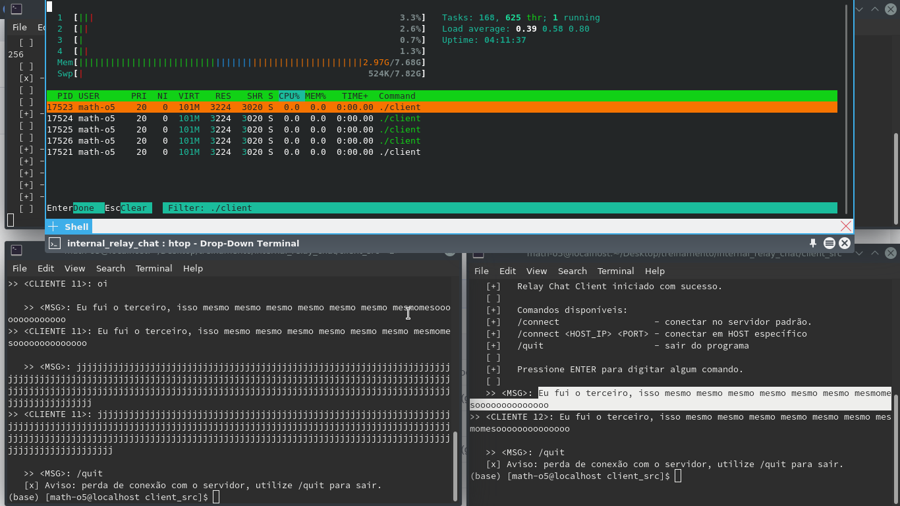
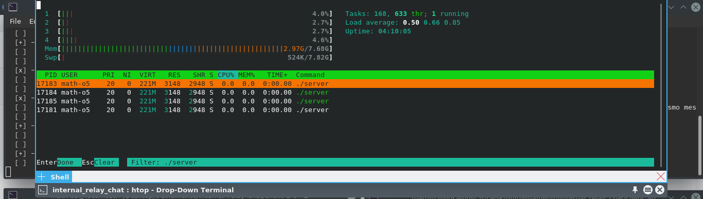

<h1 style="color=red;">internal_relay_chat  :speech_balloon:</h1>
 
epic trabalhinho redes

<h2>Descrição</h2>

Implementação dos antigos <strong>Internal Relay Chat (IRC)</strong>, o qual pode ser chamado também de antigo Telegram. O protocolo de comunicação seguido foi o IRC 1459, o qual estabelece um padrão de comunicação client-server.

<h3>Desenvolvido por:</h3>

Gabriel van Loon Bode da Costa Dourado Fuentes Rojas 
Mathias Fernandes Duarte Coelho 
joao Ricardo Minoru Nagasava 

## Compilando e Executando
Em <a href="/client_src">client_src</a> e <a href="/server_src">server_src</a> contém melhores explicações de como proceder seguramente,
Ou para facilitar, utilize os comandos `make server` `make server_run` e  `make client` `make client_run` a partir da pasta root.

## Nas pastas...
<ul>
	<li><a href="/client_src">client_src</a> executaveis, esquemas e README documentando-os. O "makeClient" facilita o teste de clientes.</li>
	<li><a href="/server_src">server_src</a> executaveis, fluxograma e README documentando-os.</li>
	<li><a href="/assets">assets</a> Todas imagens e arquivos visuais.</li>
	<li><a href="/socket_example">socket_example</a> Outras versões feitas para testes apenas.</li>
</ul>

A seguir demo e imagens <strong>inéditas</strong> de testes e dados.

<h2>Demo</h2>

	</img>
	</img>
	</img>

<h2>Testando com htop</h2>

Obs: o status R(Running) e S(Sleeping)

Nas imagens é possível ver CPU, MEM e qual thread está correndo. Podemos ver resultados otimistas.

	</img>
	</img>

<h2>Environment testados</h2>

OS: Fedora 30.x 
gcc version 9.2.1 20190827 (Red Hat 9.2.1-1)  
g++ (GCC) 9.2.1 20190827 (Red Hat 9.2.1-1) 

OS: Ubuntu 18.04.4 LTS x86_64 
Shell: bash 4.4.20 
g++ (Ubuntu 7.5.0-3ubuntu1~18.04) 7.5.0 

