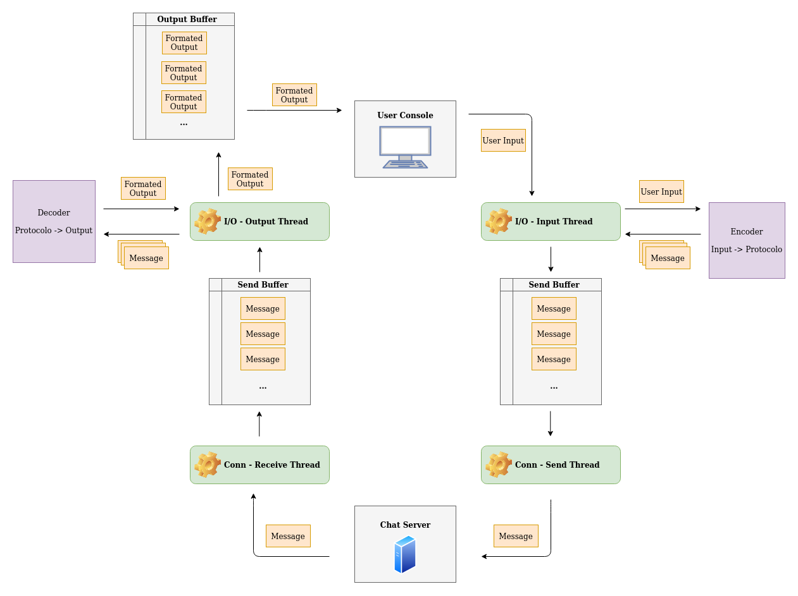

# Internet Relay Chat - Client 

Aplicação utilizada para prática e aprendizado de protocolos, sockets, threads e arquiteturas 
cliente-servidor utilizando o ambiente POSIX.

## Introdução ao Client do Chat

O funcionamento deste client pode ser resumido como uma aplicação responsável por lidar com as 
iterações com o usuário final. Ela é então responsável por garantir uma boa usabilidade de I/O
e também por garantir que os comandos e mensagens sejam devidamente codificados no protocolo
pré-estabelecido e enviados corretamente à aplicação servidor.

## Esquemático das bibliotecas

Veja a seguir uma introdução geral dos arquivos que compõem o projeto:

```
/ client_src
| -- main.cpp    Responsável por conter as variáveis globais e iniciar a execução das threads e variáveis necessárias.
| -- chat.h      Responsável por controlar as conexões/trocas de dados com o servidor e o estado do client.
| -- terminal.h  Responsável por lidar com algumas configurações necessárias para o bom funcionamento do console.
| -- codec.h     Responsável por lidar com a manipulação das mensagens trocadas com o servidor.
| -- makefile    Script auxiliar para compilar e executar o programa adequadamente.
| -- makeClient  Abre multiplos terminais para teste.
```

Todos os arquivos .h também possuem uma documentação detalhada de todas as structs e funções declaradas e devem 
ser consultados caso seja desejado um compreendimento mais profundo dos mesmos.

## Compilando e Executando

Utilize os comandos `make all` para buildar e `make run` para executar o projeto no console.

## Facilitando Teste (CUIDADO, vários clientes serão executados).

Utilize ocomando `bash makeClient.bash <nome-do-console>`.
Exemplo `bash makeClient.bash konsole` ou `bash makeClient.bash gnome-terminal`

## Threads e Arquitetura do projeto

A arquitetura do projeto foi feita pensando nos seguintes critérios:

- 1º Separar rotinas de I/O com o terminal das rotinas que lidam com I/O de dados do servidor.
- 2º Garantir que os outputs do terminal não se intercalassem causando erros de visualização.

Para isso o client conta com 4 threads, sendo duas responsáveis pela iteração com o usuário e outras duas responsáveis 
pela iteração com o servidor e assume uma forma cíclica em que os dados são carregados e processados sempre em uma única
direção.

Vamos explicar esse ciclo partindo do momento em que o usuário iterage com o programa:

- **1º Thread de Input:** é responsável por verificar se o usuário ativou o modo **INPUT _ENABLED** do 
console e  inseriu alguma mensagem ou comando no terminal. Essa informação é carregada em um Buffer **(input_buffer)** e interpretada. Caso 
seja um comando que não demande a entrega de algum dado pro servidor a string é então processada para ficar na 
conformidade do protocolo estabelecido e é por fim carregada no **Buffer de Envio (send_buffer)**.
- **2º Thread de Envio:**  tem a simples tarefa de verificar se o **Buffer de Envio** foi carregado com 
novas mensagens que devem ser enviadas ao servidor. Caso positivo, a Thread envia todas as mensagens até que o Buffer esteja
vazio e então volta à um estado de Sleep.
- **3º Thread de Recebimento:**  tem a tarefa de ficar escutando a conexão do servidor para verificar
se novas mensagens foram recebidas. Em caso positivo a mensagem é simplesmente lida e salva no **Buffer de Recebimentos (recv_buffer)**
para que possam ser lidas pela próxima thread.
- **4º Thread de Output:** é responsável por verificar se novas mensagens foram recebidas pelo servidor e aguardam processamento.
Ela então processa os dados e, caso seja necessário exibir algo no console, salva os dados já em formato ideal de output em um
**Buffer de Saida (output_buffer).** Caso o terminal esteja em modo **INPUT_DISABLED** os dados são então exibidos na tela, caso
contrário a thread aguarda que o usuário libere o controle do terminal. Essa thread também entra em modo sleep caso fique por um
longo tempo sem receber nenhum dado para ser processado/exibido.

O Esquemático o projeto pode ser então visto abaixo:



## Considerações finais e definições

#### Endereço Padrão de Conexão 
O projeto consta como conexão padrão o servidor localizado no endereço **127.0.0.1:9002** e permite que outro endereço seja
selecionado durante a etapa de conexão. Os testes de conexão só foram possíveis utilizando endereços IPv4 e não apresentaram
nenhum tipo de problema durante sua execução. Ele, no entanto, deve funcionar similarmente bem utilizando IPv6 não tendo nenhuma
restrição de implementação para tais casos.

#### Acerca do console
O projeto lida com a **biblioteca <termios.h>** para otimizar a experiência de I/O no console e para isso altera algumas
variáveis de ambiente que são devidamente resetadas ao fim da execução do programa. No entanto, caso o programa se encerre
abruptamente por motivos de erros e o terminal mantenha a configuração, basta fechar e abrir um novo terminal uma vez que
as variáveis são alteradas em escopo local e não alteram as definições da máquina do usuário.

 
