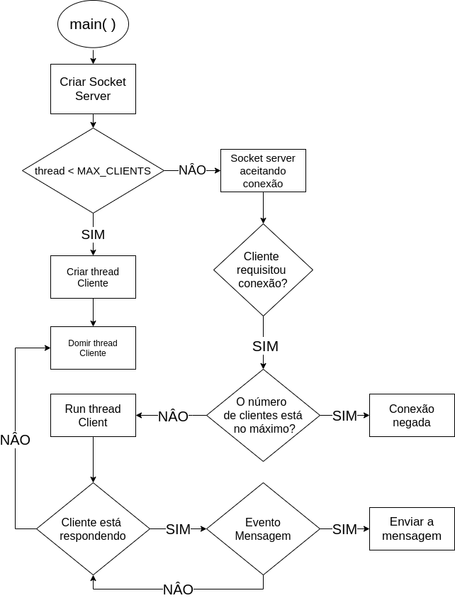

# Internet Relay Chat - Server 

Aplicação utilizada para prática e aprendizado de protocolos, sockets, threads e arquiteturas 
cliente-servidor utilizando o ambiente POSIX.

## Introdução ao Server do Chat

O servidor é responsável por estabelecer conexão e garentir o recebimento e envio de todas mensagens e entre clientes. Além disso, ele registrar todas atividades feita pelo cliente.

## Esquemático das bibliotecas

Veja a seguir uma introdução geral dos arquivos que compõem o projeto:

```
/ server_src
| -- main.cpp           Responsável por conter as variáveis globais e iniciar o servidor.
| -- connection.cpp     Responsável por controlar o protocolo e as conexões e execução dos clientes.
| -- client.cpp         Responsável por lidar com o recebimento de mensagem do cliente, decodificar e reenviar.
| -- mensagem.cpp       Responsável por imprimir logs no console.
| -- makefile           Script auxiliar para compilar e executar o programa adequadamente.
```

Todos os arquivos .h também possuem uma documentação detalhada de todas as structs e funções declaradas e devem 
ser consultados caso seja desejado um compreendimento mais profundo dos mesmos.

## Compilando e Executando

Utilize os comandos `make all` para buildar e `make run` para executar o projeto no console.

## Server Socket

1. create a socket - Get the file descriptor
2. bind to an address - Set the port.
3. listen on a port, and wait for a connection to be established.
4. accept the connection from a client.
5. send/recv - Read and write for a file
6. shutdown to end read/write.
7. close to releases data.

## Threads e Arquitetura do projeto

A arquitetura do projeto foi feita pensando nos seguintes critérios:

- 1º Atender multiplos clients requisitando o servidor.
- 2º Garantir o repasse de mensagens.
- 3° Não sobrecarregar o servidor.

Para isso o servidor coonta com uma thread que atende cada cliente. Inicialmente, são criadas todas threads e rápidamente colocadas para dormir, de modo a evitar o trabalho de cria-las e destruí-las diversas vezes. Em seguida, o processo principal fica bloqueado esperando uma nova conexão. Quando ela ocorre, uma cadeia de eventos garante uma thread para o cliente, que seguirá com ele até ele se desconectar. Os comando de receber e enviar mensagens são bloqueantes, o que garante também a eficiencia o servidor.

<h2>Fluxograma Geral do servidor</h2>
<p align="center">
	</img>
</p>

## Considerações finais e definições

#### Alterando o endereço de conexão 
Por hora o projeto ainda conta com uma conexão por padrão no servidor localizado em **127.0.0.1:9002** e caso seja necessário
conectar em outra porta é necessário alterar a Porta nas definições localizadas no arquivo **connection.h** e compilar o programa novamente.

### Adicionamos os ids nas mensagem
Para efeito visual, foi adicionado na resposta ao client o id de quem enviou a mensagem, assim facilita o depuração do sistema.

#### Comandos implementados
No momento, apenas os seguintes comandos são interpretados pelo servidor responder ao client:
- **try** Toda mensagem é enviada pelo cliente, se ele não recebeu, tentaremos mais 5 vezes. Se ele não  responde, sua conexão é descartada.
- **/quit** fecha a conexão com o cliente.
- **/ping** o servidor retorna uma mensagem com o texto 'pong'


 
